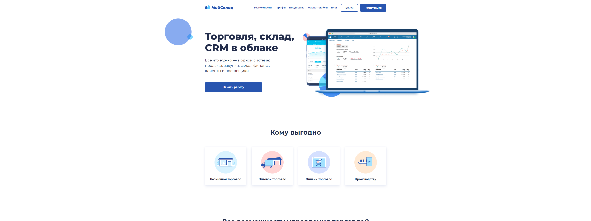
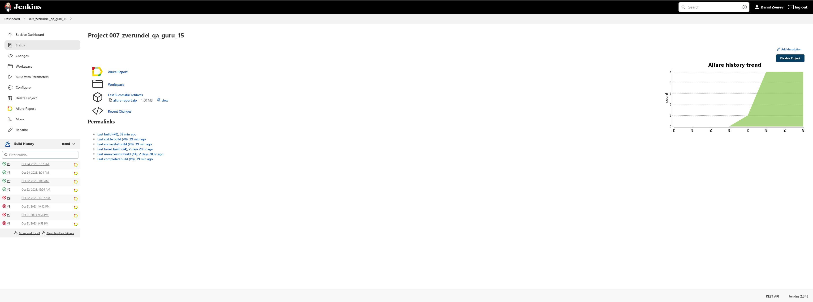
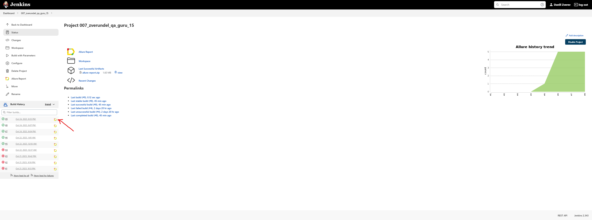
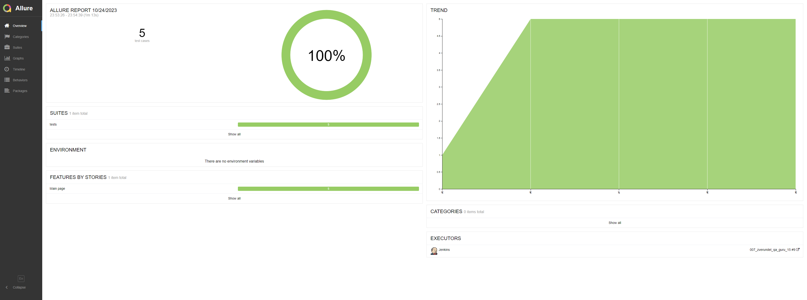
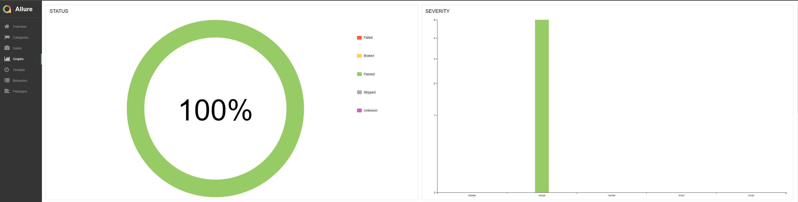
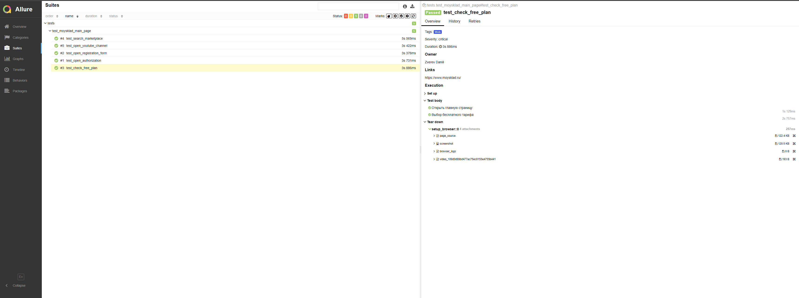
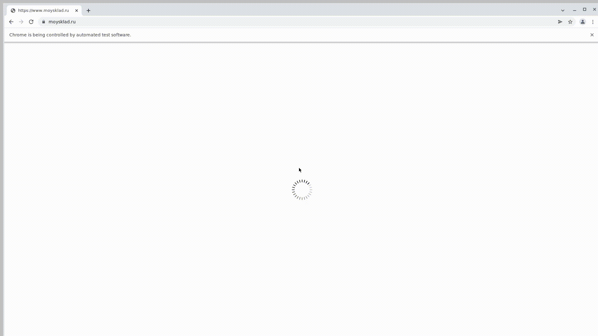
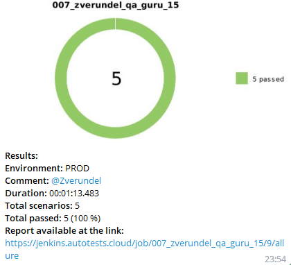

# Проект по тестированию главной страницы сайта компании "ИННОСЕТИ"
> <a target="_blank" href="https://www.moysklad.ru/">Ссылка на cайт</a>



#### Список проверок, реализованных в автотестах
- [x] Проверка перехода на страницу авторизации
- [x] Проверка открытия формы регистрации
- [x] Проверка выбора бесплатного тарифа
- [x] Проверка поиска маркетплейса
- [x] Проверка перехода на youtube канал

## Технoлoгии и инструмeнты
<p align="center">
<a href="https://www.python.org/"></a>
<a href="https://docs.pytest.org/"></a>
<a href="https://www.selenium.dev//"></a>
<a href="https://qameta.io/allure-report/"></a>
<a href="https://aerokube.com/selenoid/"></a>
<a href="https://www.jenkins.io/"></a>
<a href="https://github.com/"></a>
<a href="https://web.telegram.org/"></a>
</p>

# Запуск автотестов выполняется на сервере Jenkins
> <a target="_blank" href="https://jenkins.autotests.cloud/job/007_zverundel_qa_guru_15/">Ссылка на проект в Jenkins</a>

### Параметры сборки

* COMMENT (default: @Zverundel)


## Для запуска автотестов в Jenkins
#### 1. Открыть <a target="_blank" href="https://jenkins.autotests.cloud/job/007_zverundel_qa_guru_15/">проект</a>



#### 2. Выбрать пункт **Собрать с параметрами**
#### 3. В случае необходимости изменить параметр
#### 4. Нажать **Собрать**
#### 5. Результат запуска сборки можно посмотреть в отчёте Allure



## Локальный запуск автотестов
### Перед запуском:

В папке проекта необходимо создать .env файл со следующим содержанием:
```bash
LOGIN='user1'
PASSWORD='1234'
```
Создание виртуального окружения и установка зависимостей:
```bash
python -m venv .venv
source .venv/bin/activate
pip install -r requirements.txt
```
### Запуск:
```bash
pytest tests
```

### Получение отчёта:
```bash
allure serve
```

## Allure Отчет
##### После прохождения тестов, результаты можно посмотреть в генерируемом Allure отчете.


##### Во вкладке Graphs можно посмотреть графики о прохождении тестов, по их приоритезации, по времени прохождения и др.


##### Во вкладке Suites находятся собранные тест кейсы, у которых описаны шаги и добавлены логи, скриншот и видео.


#### Пример видеозаписи прохождения теста


# Настроено автоматическое оповещение о результатах сборки Jenkins в Telegram-бот
